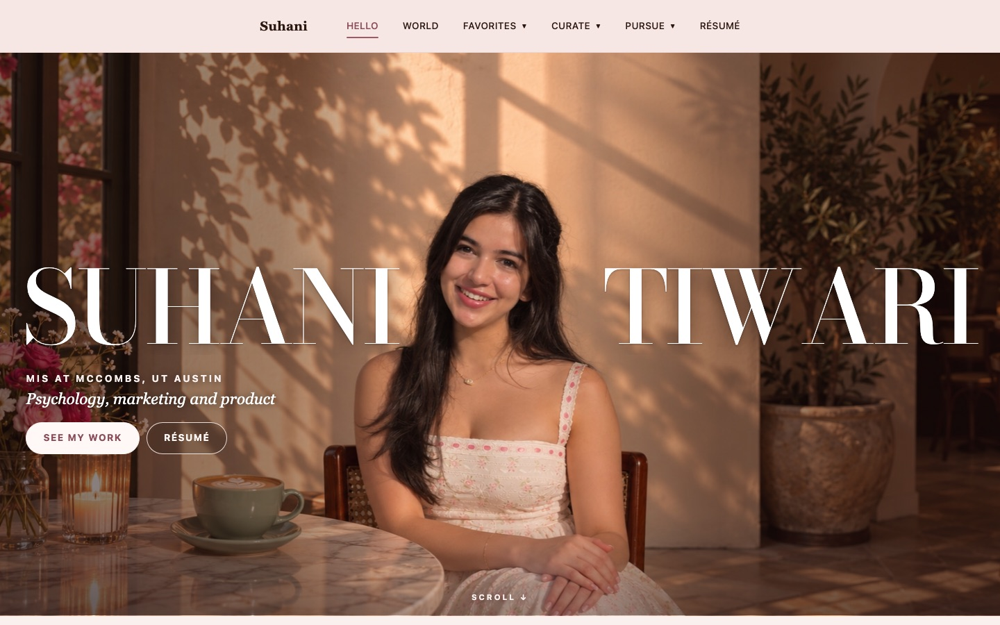
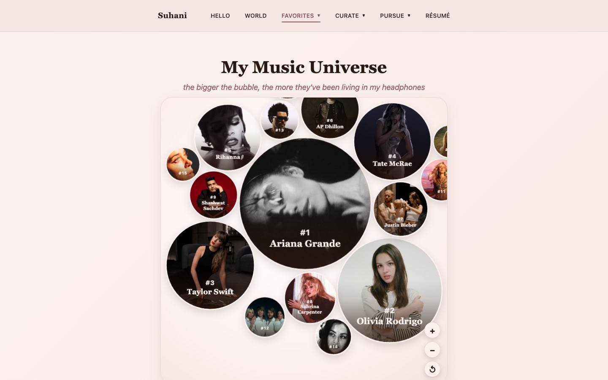
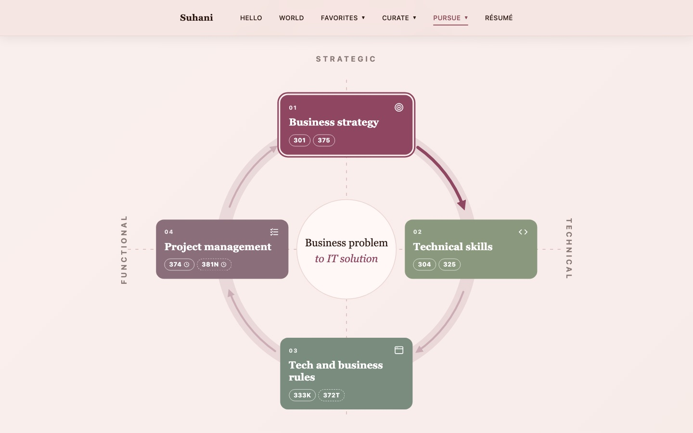
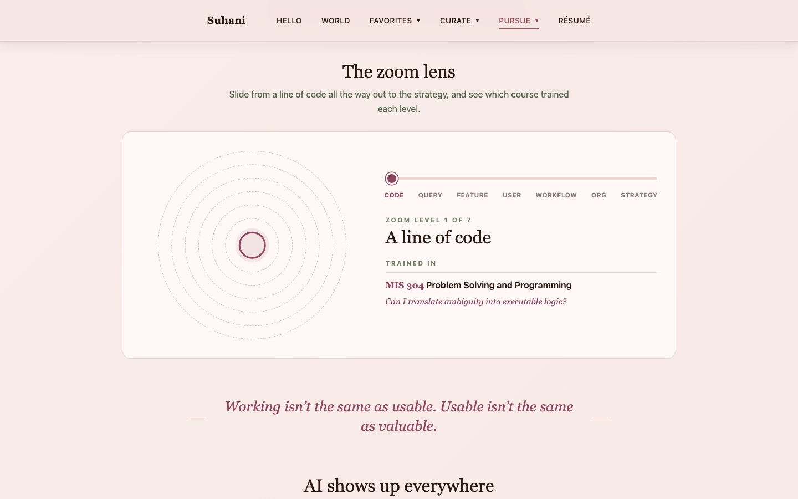
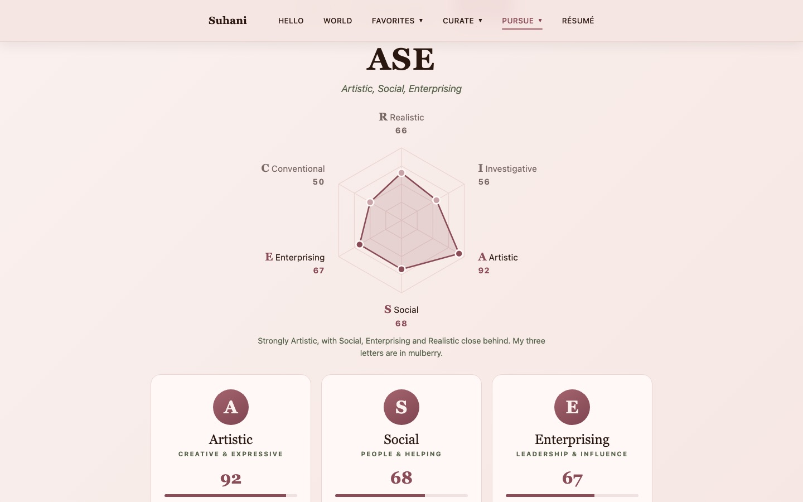
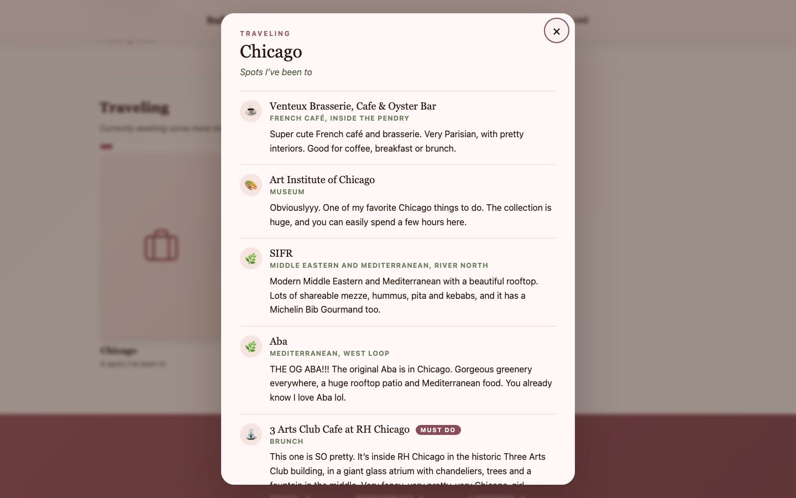

# Suhani Tiwari, Personal Portfolio

**My corner of the internet, built from scratch.**

## Ownership

© 2026 Suhani Tiwari. **All rights reserved.** This is my original work. The code is public so you can see how I build, not so you can reuse it: copying, reusing or republishing any part of it, including for a portfolio or a class assignment, is not permitted without my written permission. See [LICENSE](LICENSE).

A full-stack personal portfolio exploring where technology, business and people meet, along with everything else I'm curious about.

**→ Live at [suhanitiwari.com](https://suhanitiwari.com)**



## About the project

I wanted a portfolio that could do more than summarize a résumé.

So I built one.

This site brings together my work, education, projects, interests and personality. It also gives me a place to experiment with the technologies I'm learning in Management Information Systems at UT Austin.

## Built with

- ASP.NET Core MVC (.NET 10) and C#
- JavaScript, HTML and CSS (no front-end framework)
- Spotify Web API, MusicBrainz API and Wikipedia API
- Docker, deployed on Render

## What I built

### A home page that tells a story

The home page runs in order, like a story: a prologue, then **01 Dallas** (growing up: Girls Who Code, my children's book, Camp Invention), **02 Leaving home** (the move to McCombs, why MIS, the classes), **03 Austin** (Oracle, Acacia, the projects, the scholarships) and **04 Home** (who I am now, what I make for fun, and the quiz).

- **Every claim is a number.** Each chapter opens with real figures, defined as `StoryChapter` and `StoryStat` records at the top of `Views/Home/Index.cshtml`. Each number names its source and links to the proof. The music numbers come from [Heavy Rotation](https://suhxnitiwari.github.io/listening-galaxy/)'s export.
- **A cinematic opening.** Six seconds before the cover, once per visit. It can be skipped with any key, click or scroll, and never plays for deep links, background tabs or reduced motion.
- **Threads.** Three ideas (understanding people, making things, starting things) run through every chapter. Hover a number and everything on its thread lights up. The chapter rail shows where you are.
- **Press `/`.** A search palette built from the page itself (chapters, numbers, roles, projects, classes, cards, tabs). It flies to the result, opening any closed tab or section first.
- **Two guides.** "How to read this" (press `?`) explains the marks, and "How I built this" is the case study.

The styles and script are `wwwroot/css/story.css` and `wwwroot/js/story.js`, with no framework.

### A server-rendered MVC app where content is data

Every page is a Razor view backed by a controller action. The content on each page (courses, skills, favorite spots, trips, talks, puzzle pieces) is defined as C# records at the top of its view and rendered with loops. Adding a course, a restaurant or a TED talk is a one-line change, and the layout, counts, filters and pop-ups update on their own.

### Live Spotify data, with caching and a safe token flow

The **Listen** section shows my real top artists as a zoomable "music universe," where bubble size reflects how much I listen.

- **OAuth:** the authorization code flow runs once; after that, the site uses a stored refresh token to get access tokens.
- **Access tokens:** these are cached in memory and renewed a minute before they expire. A lock makes sure that when several requests arrive at once, only one of them fetches a new token.
- **API results:** these are cached for 12 hours with `IMemoryCache`, so most visitors never trigger a Spotify call.
- **Genres:** these come from the **MusicBrainz API**. The site limits itself to one request per second, as MusicBrainz asks, and keeps each artist's genres in a cache.
- **Secrets:** they never live in the code. Locally they're stored in user secrets, and on Render in environment variables. The saved login is kept out of git and out of published builds, and connecting a new account is switched off in production.



### Interactive components in plain JavaScript

**MIS curriculum cycle.** An SVG diagram of how my MIS courses connect: strategy, then technical skills, then building, then delivery, and back to strategy. It scales with the page using container query units. Picking a step highlights it along with its outgoing arrow. Each course chip opens a native `<dialog>` with the course's skills and the big question it taught me. On phones the diagram turns into an accordion.



**Zoom lens.** A range slider that zooms out from a line of code to company strategy, showing which course trained each level.



**How I Work.** My RIASEC results drawn as a real hexagon chart, computed from my scores, plus CliftonStrengths shown as slides.



**Shelves and pop-up cards.** One set of reusable horizontal rows with drag-to-scroll, arrow buttons, keyboard support and "See all." They power the Watch, Read and Make pages. Clicking a card opens a native `<dialog>` for a recipe, a piece of artwork, a video or a trip.



### Accessible and responsive

- Keyboard support throughout: arrow keys for tabs, the cycle and shelves; Esc and outside clicks close every pop-up
- ARIA roles, labels and states on tabs, toggles, dialogs and live regions
- Animations respect `prefers-reduced-motion`
- Layouts built for phone widths (for example, the MIS diagram becomes an accordion and the "Where it all meets" circle becomes a grid)

### Deployment

A two-stage Dockerfile builds the app with the .NET SDK and runs it on the smaller ASP.NET runtime image. Render builds and deploys it on every push to `main`. The app reads Render's port from `$PORT`, and it trusts forwarded headers so HTTPS redirects work behind Render's proxy.

## What I learned

> I learn enough technology to build it, enough business to know why we're building it, and enough about people to make sure what we build actually works for them.

Building my own portfolio turned those three pieces into one project. Every feature required decisions: whether something could work technically, what information mattered, how someone would interact with it, and whether the technology actually improved the experience.

## Project structure

```
Controllers/
  HomeController.cs      one action per page
  SpotifyController.cs   Spotify login and my top artists, songs and genres (cached for 12 hours)
Services/
  SpotifyService.cs      Spotify and MusicBrainz calls, token refresh
Views/
  Home/                  one Razor view per page, with its content as data at the top
  Shared/_Layout.cshtml  navigation, footer and shared styles
wwwroot/
  css/  js/  images/     shared styles and scripts, photos and artwork
docs/                    README screenshots and the repository preview image
Dockerfile               builds and runs the site on Render
```

## Running it locally

You'll need the [.NET 10 SDK](https://dotnet.microsoft.com/download).

```bash
dotnet build
dotnet run --launch-profile http
```

Then open http://localhost:5142.

Everything works without setup except the Listen section, which needs Spotify credentials:

```bash
dotnet user-secrets set "Spotify:ClientId" "<your client id>"
dotnet user-secrets set "Spotify:ClientSecret" "<your client secret>"
```

Then open http://127.0.0.1:5142/spotify/login to connect an account (the redirect URI in `appsettings.json` must match your Spotify app).

On Render, the same settings come from environment variables: `Spotify__ClientId`, `Spotify__ClientSecret` and `Spotify__RefreshToken`.

## Contact

[suhanitiwari.com](https://suhanitiwari.com) | [LinkedIn](https://www.linkedin.com/in/suhxnitiwari) | suhxnitiwari@gmail.com
